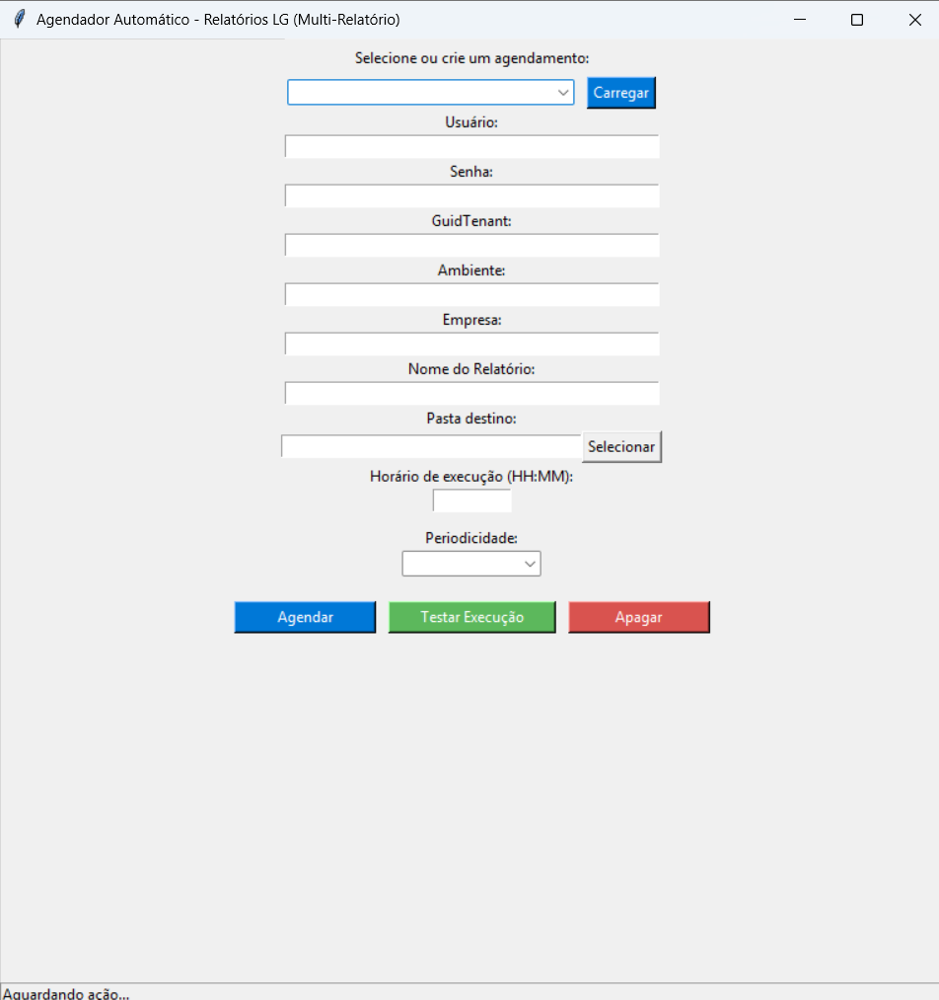

# 📊 Report Automator  
Automatize a geração e o agendamento de relatórios desenvolvidos pelo **FPW Reports da LG Lugar de Gente**.



---

## 🚀 Visão Geral  

O **Report Automator** utiliza a **API oficial da LG** para solicitar a geração de relatórios e realizar o **download automático do arquivo**, permitindo que você o integre facilmente ao **Power BI** ou a outros sistemas de análise.

Além disso, ele oferece uma **interface simples e direta** para agendar a execução automática dos relatórios por meio do **Agendador de Tarefas do Windows**, eliminando a necessidade de intervenções manuais e garantindo atualizações constantes.

💡 Ideal para equipes de **RH, TI e consultores** que precisam garantir **consistência, agilidade e automação** na extração de dados dos sistemas LG.

---

## 🧠 Funcionalidades Principais
✅ Autenticação direta via API SOAP da LG  
✅ Monitoramento automático de status de processamento (`StatusProcessamento = 3551`)  
✅ Download automático do arquivo gerado  
✅ Criptografia de credenciais (`cryptography.fernet`)  
✅ Agendamento (diário, semanal, mensal) via Agendador do Windows  
✅ Interface gráfica simples e intuitiva (Tkinter)  
✅ Pronto para integração com Power BI  

---

## 🧩 Arquitetura do Projeto
```
Report_Automator/
├── src/
│   ├── gerador_gui.py               # Interface gráfica principal
│   ├── gerar_relatorio_lg.py        # Lógica de integração via API LG
│   ├── crypto_utils.py              # Criptografia de credenciais
│   └── assets/
│       ├── icon.ico                 # Ícone do aplicativo
│       └── screenshot_gui.png       # Imagem da interface do aplicativo
├── dist/
│   └── ReportAutomator.exe          # Executável gerado com PyInstaller
├── README.md
├── requirements.txt
├── LICENSE
└── .gitignore
```

---

## 💻 Instalação

### 🧱 Opção 1 — Executável (sem necessidade de Python)
Baixe o arquivo `ReportAutomator.exe` na pasta `dist` e execute diretamente no Windows.  
O programa é portátil e não requer instalação.

---

### 🐍 Opção 2 — Execução via código (modo desenvolvedor)
1. Clone o repositório:
   ```bash
   git clone https://github.com/brunoramos/Report_Automator.git
   cd Report_Automator/src
   ```
2. Instale as dependências:
   ```bash
   pip install -r requirements.txt
   ```
3. Execute o programa:
   ```bash
   python gerador_gui.py
   ```

---

## 🔐 Segurança  
- As credenciais (usuário e senha LG) são **armazenadas localmente de forma criptografada**.  
- A chave de criptografia é gerada e armazenada automaticamente no diretório do aplicativo.  
- Nenhum dado é transmitido ou armazenado fora do ambiente local.

---

## 🧭 Como obter o GuidTenant e o Ambiente

Para preencher corretamente os campos **GuidTenant** e **Ambiente**:

1. Acesse o portal da LG:  
   🔗 [https://portalgentedesucesso.lg.com.br/](https://portalgentedesucesso.lg.com.br/)
2. No menu principal, vá em:  
   **Central Técnica → API Suíte Gen.te Nuvem → Autenticação**
3. Lá você encontrará:  
   - As instruções para obter o **GuidTenant** (identificador do ambiente do cliente)  
   - O código do **Ambiente** (geralmente um número como “270”)  
   - Orientações sobre **permissionamento e perfis de acesso**, caso o retorno da API indique acesso negado.

Essas informações são necessárias para que a autenticação e o agendamento funcionem corretamente.

---

## 🕓 Agendamento Automático
O agendamento é feito via **Agendador de Tarefas do Windows**, com suporte a três periodicidades:

| Tipo de Execução | Descrição |
|------------------|------------|
| Diário | Executa o relatório todos os dias no horário definido |
| Semanal | Executa uma vez por semana |
| Mensal | Executa uma vez por mês |

A configuração é salva em um arquivo `.json` no mesmo diretório do aplicativo.

---

## 🧰 Integração com Power BI  
1. Configure a pasta destino no aplicativo.  
2. No Power BI, acesse **Obter Dados → Texto/CSV** e selecione o arquivo `relatorio_funcionarios.csv`.  
3. Crie o painel desejado.  
4. Configure a atualização automática de acordo com o agendamento criado.

---

## ⚙️ Tecnologias Utilizadas

| Tecnologia | Função |
|-------------|--------|
| **Python 3.10+** | Linguagem principal |
| **Tkinter** | Interface gráfica |
| **Requests + XML** | Consumo da API SOAP |
| **Cryptography** | Criptografia de credenciais |
| **PyInstaller** | Geração do executável |
| **Power BI** | Visualização dos relatórios |


---

## 💼 Sobre o Autor

👨‍💻 **Bruno Ramos**  
Consultor em TI especializado nas soluções da LG Lugar de Gente para **Folha de Pagamento** e demais **subsistemas de RH**.

📧 bruno@bbrconsultoria.com.br  
🔗 [LinkedIn](https://www.linkedin.com/in/brunobarrosoramos)  

> Este projeto faz parte do portfólio de automações empresariais desenvolvidas por **Bruno Barroso Ramos Consultoria em TI**.

---

## 🪪 Licença
Distribuído sob a **licença MIT** — uso livre, inclusive comercial, com atribuição de crédito.
